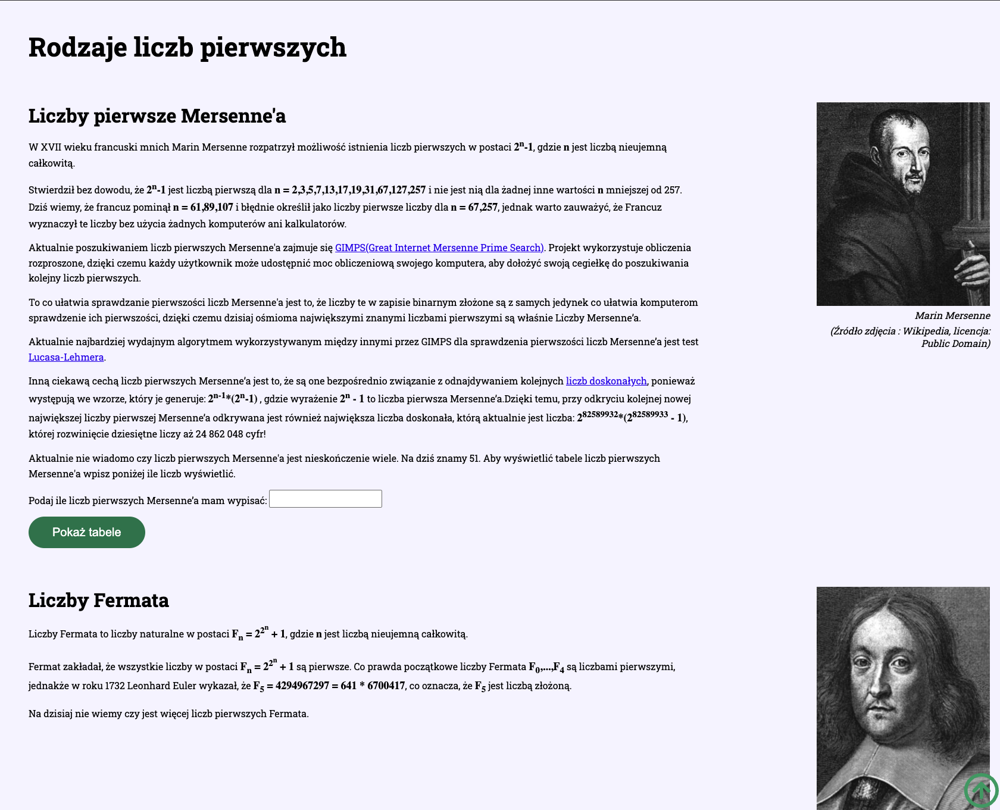
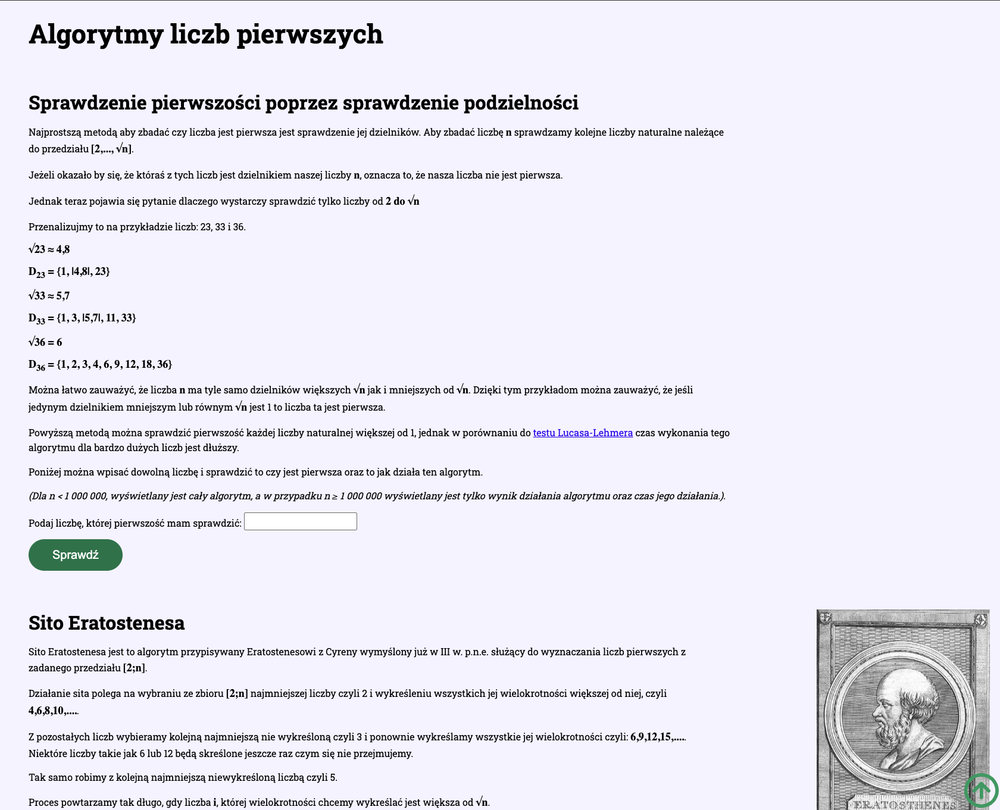
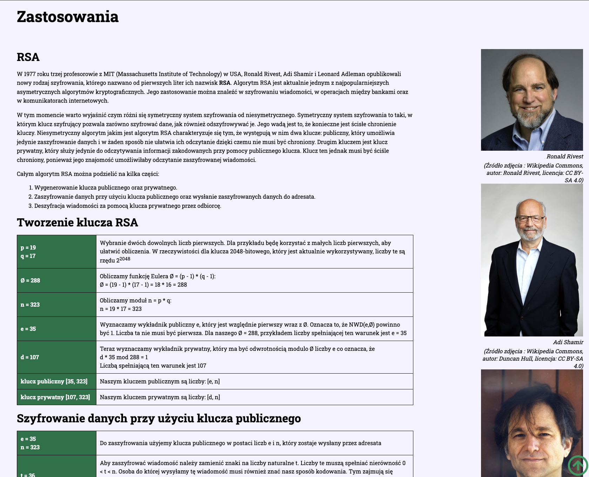
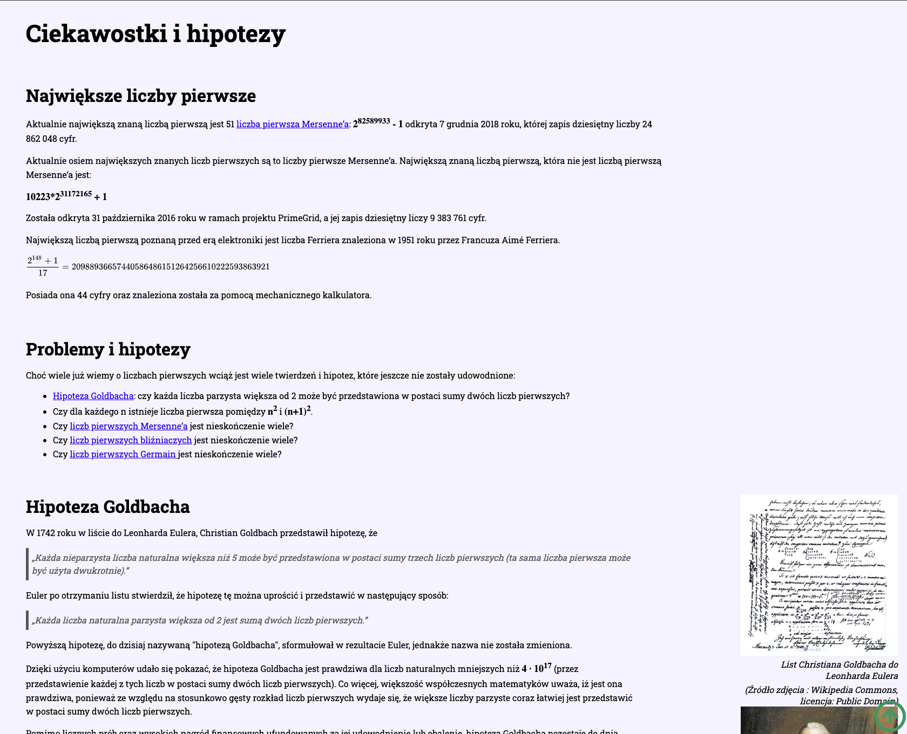

# Prime Numbers

## Table of Contents

- [Prime Numbers](#prime-numbers)
  - [Table of Contents](#table-of-contents)
  - [Overview](#overview)
  - [Key Features](#key-features)
  - [Technologies Used](#technologies-used)
    - [Frontend Technologies](#frontend-technologies)
  - [Getting Started](#getting-started)
    - [Prerequisites](#prerequisites)
    - [Installation and Setup](#installation-and-setup)

## Overview

This website was created as part of the 13th edition of the "Seeing Mathematics" competition organised by the Stanisław Staszic AGH University of Science and Technology in Kraków. It provides comprehensive information about prime numbers, their properties, and significance in mathematics.

The project was awarded the 2nd degree award by the AGH University of Science and Technology.

[Live Demo](https://radekrzepka.github.io/prime-numbers/)






## Key Features

- Detailed exploration of prime number distribution
- Various types of prime numbers explained
- Algorithms for finding prime numbers
- Real-world applications of prime numbers
- Current hypotheses and unsolved problems related to prime numbers

## Technologies Used

### Frontend Technologies

- HTML5 for structure
- Sass for advanced styling
- JavaScript for interactive elements

## Getting Started

### Prerequisites

- Any modern web browser
- Basic understanding of HTML, CSS, and JavaScript (for developers)

### Installation and Setup

1. Clone the repository:

   ```
   git clone https://github.com/radekrzepka/prime-numbers.git
   ```

2. Navigate to the project directory:

   ```
   cd prime-numbers
   ```

3. Open the index.html file in your browser or use a local development server.

4. For development with Sass:
   - Install Sass if you don't have it already
   - Compile Sass files to CSS
